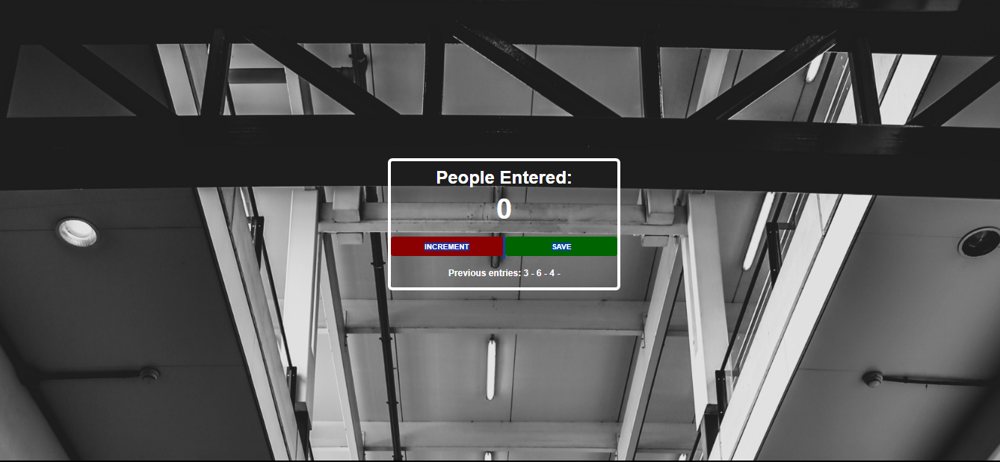

# Subway People Counter App

This is a simple Subway People Counter App built with vanilla JavaScript, HTML, and CSS. The app lets you increment the count of people entering a subway by clicking a button. It showcases basic DOM manipulation and event handling in JavaScript.

## Screenshot

## Live Demo

You can try the app live here: [Live Demo](https://scrimba-passenger-conter-app.netlify.app)

## Features

- Displays a live count of people entering the subway.
- Increment the count by clicking the "INCREMENT" button.
- Count updates dynamically in the DOM without refreshing the page.